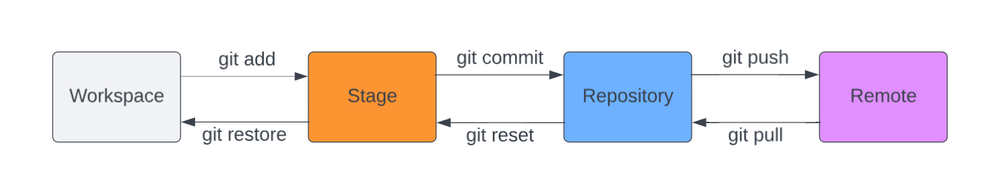
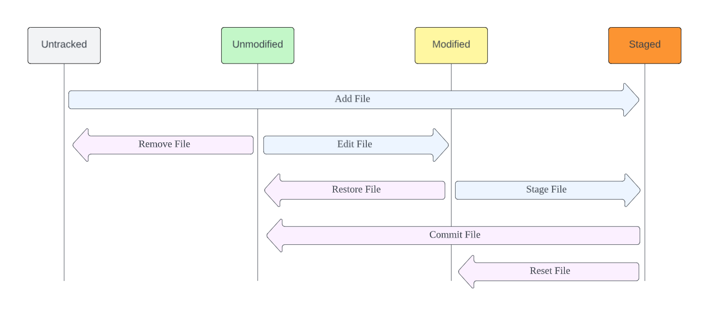
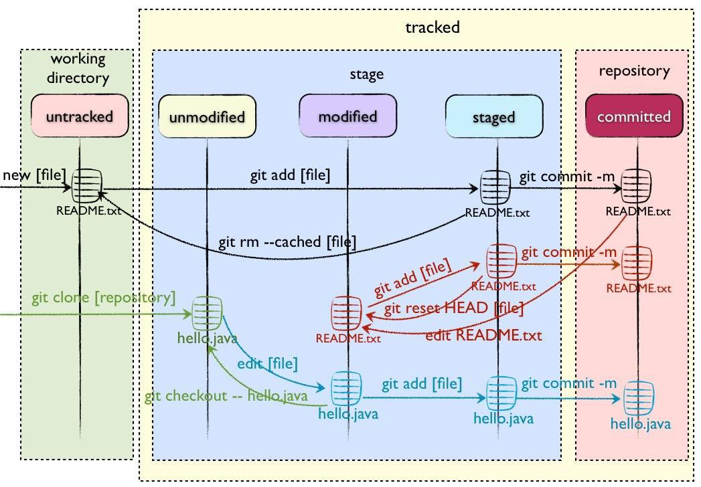

# Git

## 1. Working Parts

There are **four** working parts in Git：

- Workspace
- Stage
- Repository
- Remote

The conversion between these parts is as follows：



## 2. File Status

There are **four** different status of files：

- **Untracked:** Files that are present in the working directory but are not part of the Git repository. Git is not currently tracking these files.
- **Unmodified:** Files that are in the Git repository and have not been modified since the last commit. Git recognizes these files as unchanged.
- **Modified:** Files that have been changed since the last commit. Git identifies these changes, but they have not been staged for the next commit yet.
- **Staged:** Files that have been modified and staged for the next commit. The changes have been added to the staging area.

The conversion between them is as follows：



Commands for conversion are as follow:



## 3. Common Commands

### 3.1 **Setup and Config**

- config

```bash
# show git configuration
git config --list

# edit config file
git config -e

# set config locally
git config user.name "User Name"

# set config globally
git config --global user.email "User Email"
```

### 3.2 **Getting and Creating Projects**

- init

```bash
# create a new git repository at the current directory
git init

# create a new git repository at a specific path
git init [directory name]
```

- clone

```bash
# clone a exist git repository form url to the current directory
git clone [url]

# clone a exist git repository form url to a specific path
git clone [url] [directory name]
```

### 3.3 **Basic Snapshotting**

- status

```bash
# check status for all files
git status

# check status for a specific file
git status [file name]
```

- add

```bash
# add file into Stage
git add [file name 1] [file name 2] ...

# add dirctory into Stage
git add [dirctory name]

# add all files in current dirctory
git add .
```

- rm

```bash
# remove file from Workspace & Stage
# and add "deleted" into Stage to be commited
git rm [file name]
= 
rm [file name]
git add [file name] 

# remove file from Stage
# and add "deleted" into Stage to be commited
# and make Workspace file Untracked  
git rm --cached [file name]
```

- mv

```bash
# move file 
# and add "renamed" into Stage 
git mv [file name 1] [file name 2]
=
mv [file name 1] [file name 2]
git add [file name 1] [file name 2]
```

- restore

```bash
# restore file from Stage into Workspace
git restore [file name]

# restore file from Repository into Stage
git restore --staged [file name]
=
git reset [file name]
```

- commit

```bash
# commit files from Stage into Repository
git commit -m [message]

# commit specific files from Stage into Repository
git commit [file name 1] [file name 2] ... -m [message]

# commit without add
git commit -a

# modify the last commit with the current Stage changes.
git commit --amend
```

- reset

```bash
# reset from commit
git reset [--method] [commit]

method: soft | mixed(default) | hard
soft: using [commit] to reset Repository
mixted: using [commit] to reset Stage & Repository
hard: using [commit] to reset Workspace & Stage & Repository

commit: HEAD(default) 
HEAD~0 = HEAD
HEAD~1 = HEAD^
HEAD~2 = HEAD^^
HEAD~3 = HEAD^^^

# reset specific files from commit
git reset [--method] [commit] [file name]

# example: using HEAD to reset Stage & Repository
# = restore file from Repository into Stage
git reset [file name] 

```

### 3.4 **Branching and Merging**

- branch

```bash
# list all branch
git branch

# create new branch
git branch -c [branch name]

# delete branch
git branch -d [branch name]
```

- switch

```bash
# switch branch
git switch [branch name]

# swith bach to last-visited branch
git switch -

# create a new branch and switch to it
git switch -c [branch name]
```

- merge

```bash
# merge branch into current
git merge [branch name]

# if conflicts occur

# option1 abort merge
git merge --abort

# option2 fix conflicts & git add & git commit
vim [conflict file name]
git add [conflict file name]
git commit [conflict file name]

```

- stash

```bash
# save Workspace & Stage in a temp stack
git stash save

# show stash list
git stash list

# apply stash 
git stash apply # most recently
git stash apply stash@{x} # stash@{x} 

# drop stash
git stash drop # most recently
git stash drop stash@{x} # stash@{x}

# pop stash
git stash pop
=
git stash apply
git stash drop

# show diff
git stash show # most recently
git stash show stash@{x} # stash@{x}

# clear all stash
git stash clear

# use stash to create branch
git stash branch [branch name] [stash]
```

### 3.5 **Sharing and Updating Projects**

- pull

```bash
# pull from Remote
git pull

git pull [remote host] [remote branch name]:[local branch name]

# fill not up to date, cannot merge
# stash save local change, pull from remote, and then pop stash save
git stash save
git pull
git stash pop
```

- push

```bash
# push to Remote
git push

git push [remote host] [local branch name]:[remote branch name]
```

- remote

```bash
# list remote repository
git remote

# list remote repository & url
git remote -v

# add a new remote repository
git remote add [remote name] [remote url]

# rename a remote repository
git remote rename [old name] [new name]

# remove a remote repository
git remote remove [remote_name]

# set url
git remote set-url [remote name] [new url]

# show info
git remote show [remote name]
```

### 3.6 **Inspection and Comparison**

- diff

```bash
# show diff between Workspace & Stage
git diff
git diff [file name]

# show diff between Repository & Stage
git diff --cached
git diff --staged

git diff --cached [file name]
git diff --staged [file name]

# show diff between different branches
git diff [branch name 1] [branch name 2] 
```

- log

```bash
# show history record
git log

# show brief version of history record
git log --oneline

# show graph version of history record
git log --graph
```